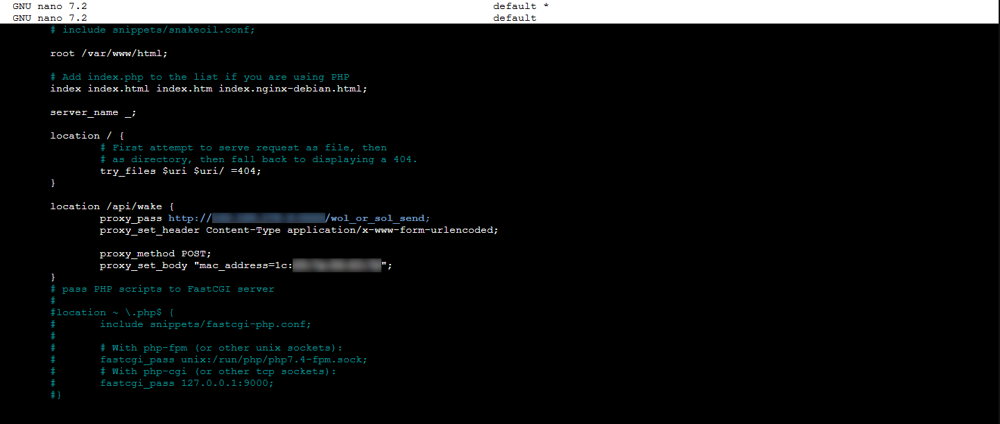

# JellyList

A simple, selfhostable website that lists content on your Jellyfin Server and allows you to start it via Wake on Lan.

---

## Use case

I had the following problem the other day: I am sharing my selfhosted Jellyfin server with my family and friends by exposing it to the internet. If they wanted to watch something on it, they would have to message me every time to turn it on. 

That **sucked**. So I came up with this webservice. Once it runs, it hosts a website which contains your entire Jellyfin library by talking directly to the Jellyfin API. It updates automatically by using a cronjob. Above the List, you will have the option to send a Lake on Lan Packet to the server if it is turned off.

With JellyList, every user can see which movies and shows are available, even if the server is turned off, and power it on to watch it.

---

## 📥Prequisiteries

For this to work, you will need to set up a few things. First up, you will need to run a [GPTWOL](https://github.com/Misterbabou/gptwol) server in the same network as your Jellyfin Server. JellyList sends a get request to its backend to send the Wake on Lan Package. I recommend to run it in another VM or container. 

I also highly recommend to run JellyList in a VM or a container, as you will be exposing it to the open web. When GPTWOL is set up, try entering its IP into your web browser to make sure its working!

---

## 💻Installation

To get started, you have download and run which will NGINX (if its not already installed) and copy the htm files to its corresponding location. 

```
curl -O https://raw.githubusercontent.com/mQrak/JellyList/refs/heads/main/install.sh
chmod a+x install.sh
./install.sh
```

Next, you will have to edit the NGINX configuration to interface with GPTWOL´s backend. For that, you´ll have to edit the file called 'default' in `/etc/nginx/sites-enabled`. You have to paste the code below into the location tab. 

Of course, you will need to enter your custom values (IP adress and mac adress of the Jellyfin server).

```
location /api/wake {
    proxy_pass http://<your_ip>:5000/wol_or_sol_send;
    proxy_set_header Content-Type application/x-www-form-urlencoded;

    proxy_method POST;
    proxy_set_body "mac_address=<your servers Mac adress>";
}
```

It should look something like this:



Once thats done, reload NGINX by executing `systemctl restart nginx`.

You should now be able to start your server by entering the local IP of your JellyList container in your browser and clicking start server.

---

## 🔄Updating

Of course we want the list on the website to be synced with our server. This is done with`sync.py`.  This file will not be exposed to the public web. For it to be able to parse your Jellyfin library, you will need to create end enter a Jellyfin API key. This can be done in the Jellyfin Webend. You´ll also have to add the IP adress / domain where its gonna fetch its data from. The script will save the information in a .json file at /var/www/html/json, where JellyList will take its movies and shows from. 

For making it update automatically, just create a cronjob that executes sync.py in your desired interval.